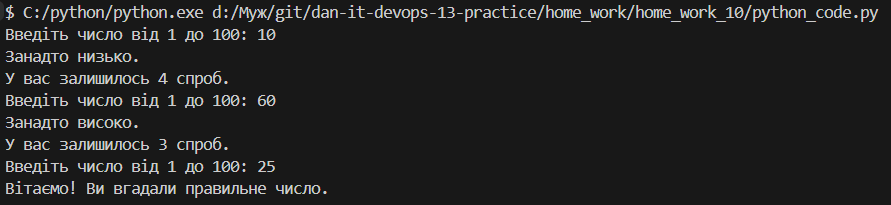

# HW_10
## 1. Код
```python
import random

number_of_attempts = 5
random_number = random.randint(1, 100)

def simple_games(number_of_attempts, random_number):
    answer = False

    while number_of_attempts > 0:
        user_number = int(input("Введіть число від 1 до 100: "))

        if user_number < random_number:
            print("Занадто низько.")
        elif user_number > random_number:
            print("Занадто високо.")
        else:
            print("Вітаємо! Ви вгадали правильне число.")
            answer = True
            break

        number_of_attempts -= 1
        print(f"У вас залишилось {number_of_attempts} спроб.")

    if not answer:
        print(f"Вибачте, у вас закінчилися спроби. Правильне число було {random_number}")

if __name__ == "__main__":
    simple_games(number_of_attempts, random_number)
```
## 2. Скрін роботи
