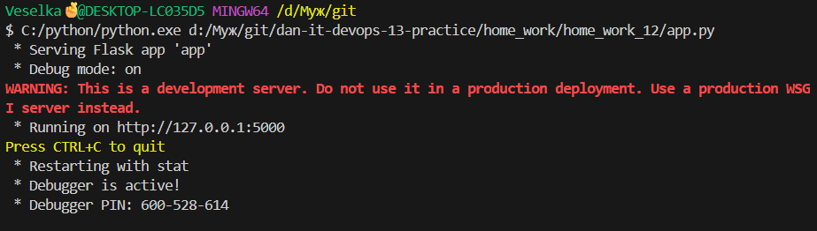
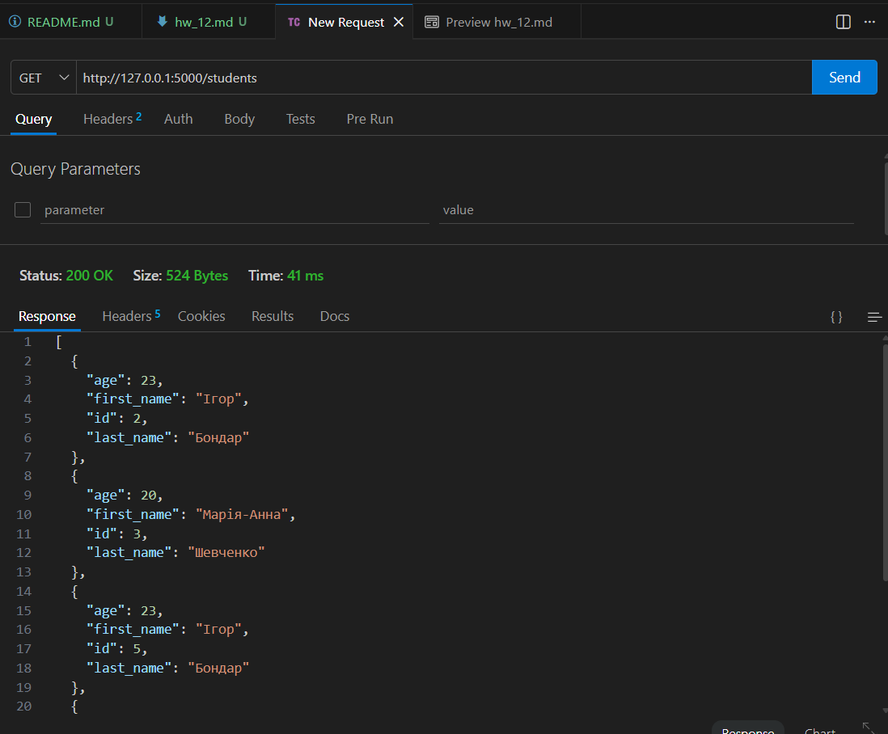
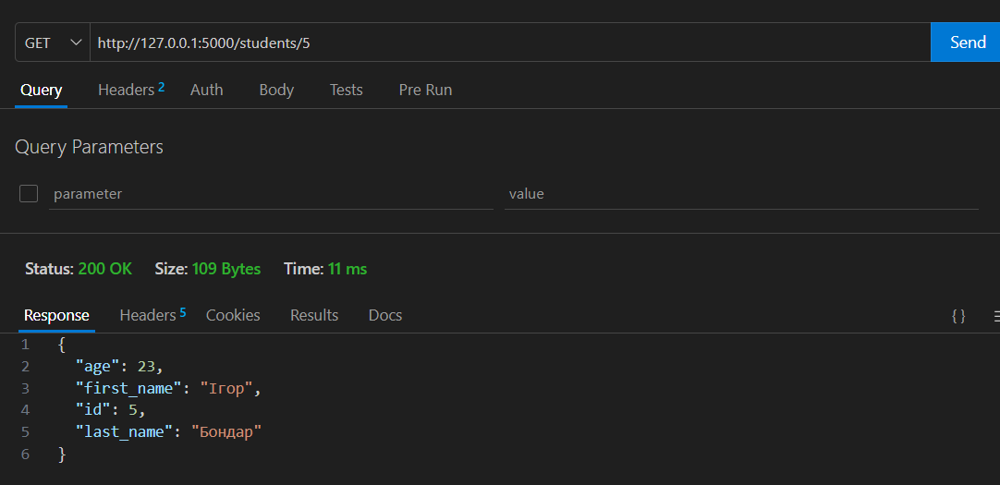
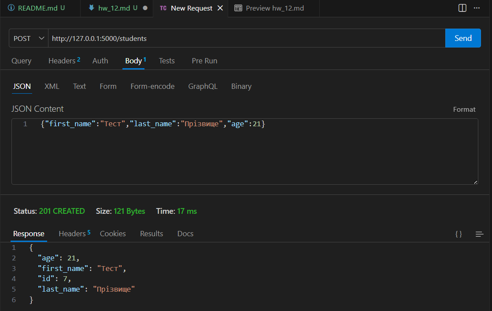
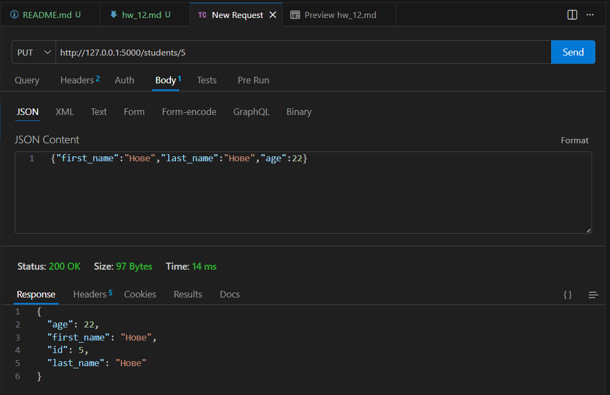
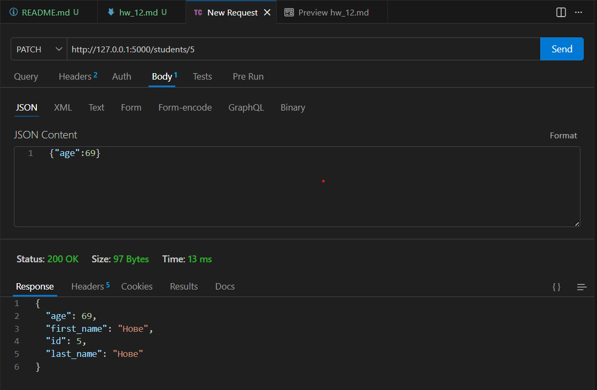
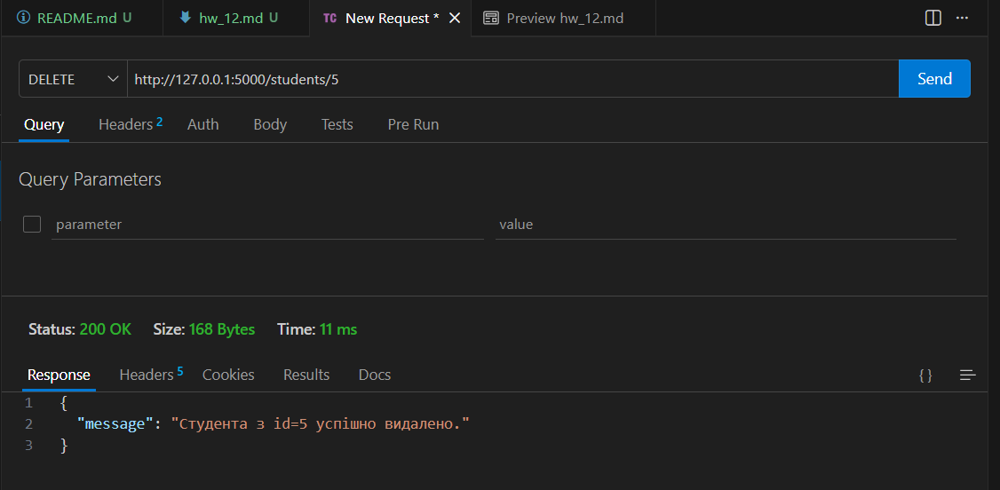

# Домашнє завдання 12 — формат здачі

## 1. Код програми `app.py` і скрін роботи програми

Код: [app.py](./app.py)

**Скрін роботи програми** (термінал із запущеним сервером, наприклад вивід після `python app.py`):

---

## 2. Скріни HTTP-методів

**GET** (наприклад список усіх або один студент за id / за прізвищем):

**POST** (створення студента, тіло JSON):

**PUT** (повне оновлення студента за id):

**PATCH** (оновлення віку за id):

**DELETE** (видалення за id):

---

## 3. Код `test_requests.py`

Код: [test_requests.py](./test_requests.py)

---

## 4. Результати `results.txt`

Вміст: [results.txt](./results.txt) (оновлюється після `python test_requests.py`, коли сервер запущено).

---

## 5. Залежності `requirements.txt`

Файл: [requirements.txt](./requirements.txt)

