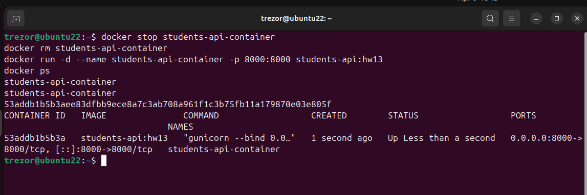
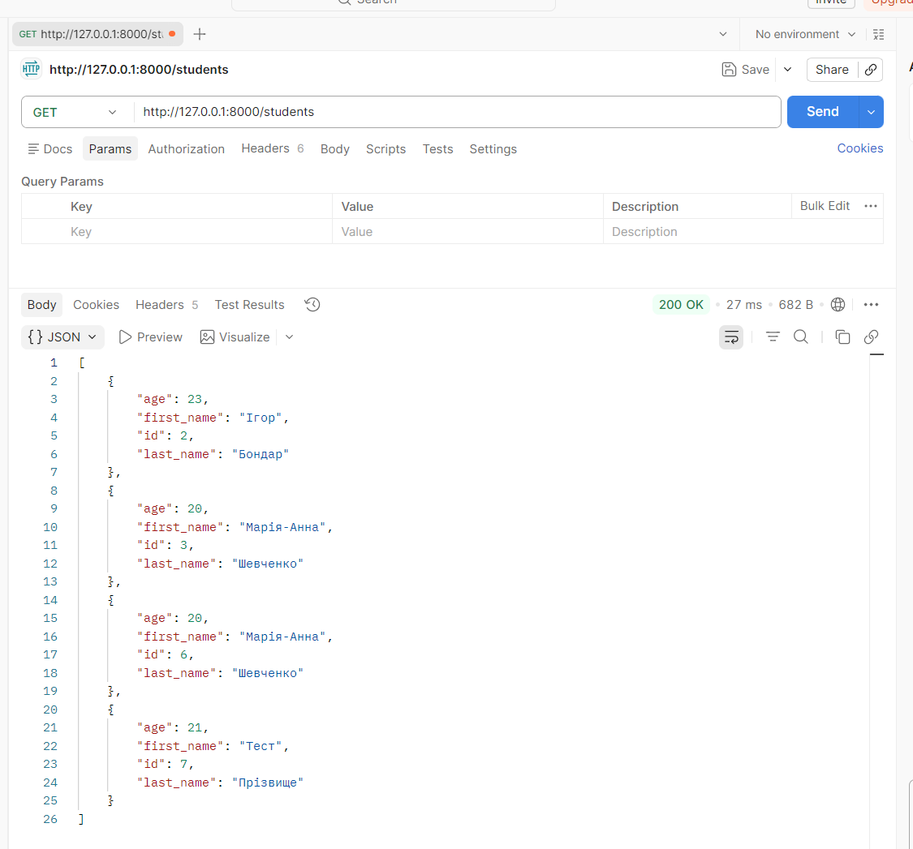
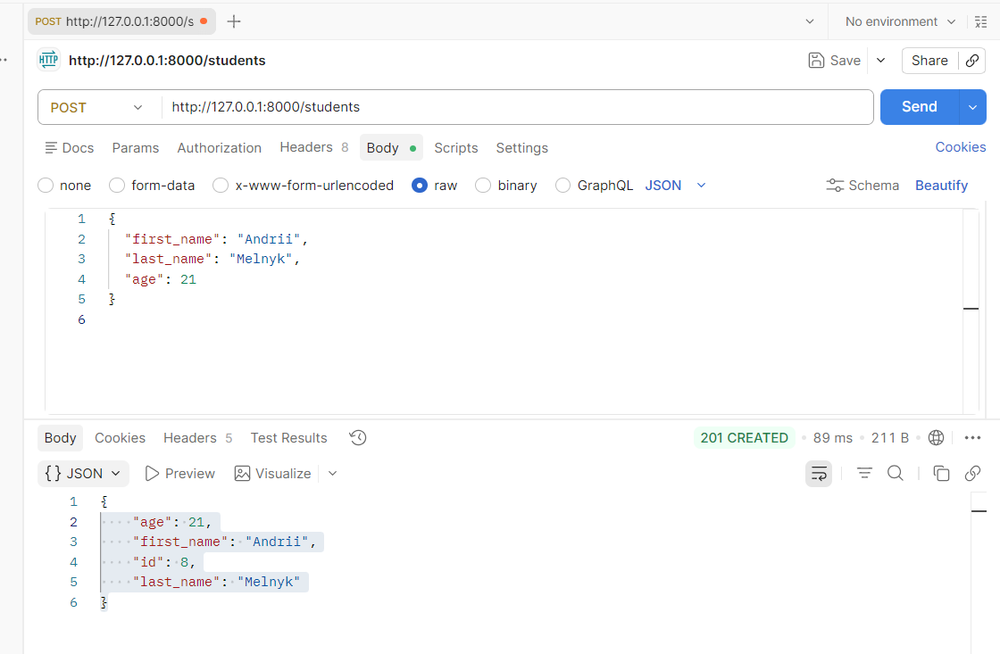

# Домашнє завдання 13 — формат здачі

## 1. Код `Dockerfile`

Файл: [Dockerfile](../home_work_12/Dockerfile)

---

## 2. Скрін запуску контейнера

**Скрін запуску контейнера** (термінал із командою `docker run` і списком контейнерів після `docker ps`):

---

## 3. Скрін запиту через Postman

**GET** (приклад запиту до контейнера за адресою `http://127.0.0.1:8000/students`):

**POST** (створення студента через Postman, тіло JSON):

---

## 4. Код `requirements.txt`, `Dockerfile`, `.dockerignore`

**requirements.txt**: [requirements.txt](../home_work_12/requirements.txt)

**Dockerfile**: [Dockerfile](../home_work_12/Dockerfile)

**.dockerignore**: [.dockerignore](../home_work_12/.dockerignore)
