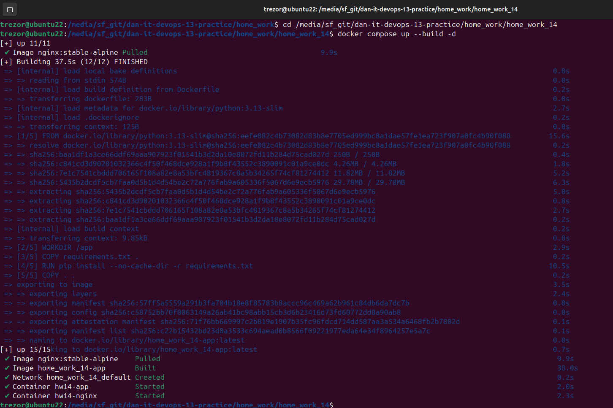
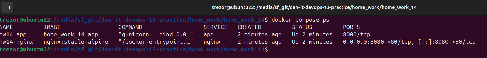
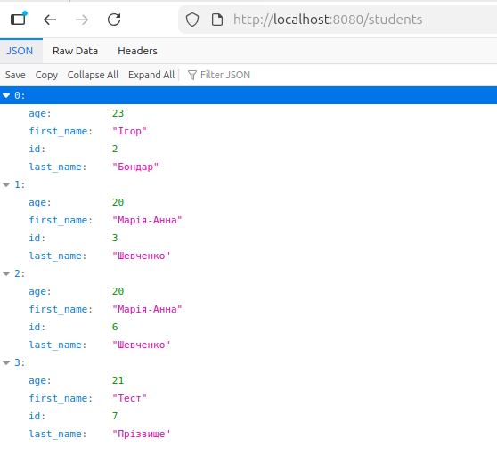

# Домашнє завдання 14 — формат здачі

## 1. Код `docker-compose.yml`

```yaml
services:
  app:
    image: homework13-app
    build:
      context: .
    container_name: hw14-app
    restart: unless-stopped

  nginx:
    image: nginx:stable-alpine
    container_name: hw14-nginx
    depends_on:
      - app
    ports:
      - "8080:80"
    volumes:
      - ./nginx.conf:/etc/nginx/conf.d/default.conf:ro
    restart: unless-stopped
```

У сервісі `app` вказано `image: homework13-app`, а також `build: .`, тому Docker-образ застосунку створюється динамічно через `docker compose` на основі `Dockerfile` з попередньої роботи.

---

## 2. Код `Dockerfile`

```dockerfile
FROM python:3.13-slim

ENV PYTHONDONTWRITEBYTECODE=1
ENV PYTHONUNBUFFERED=1

WORKDIR /app

COPY requirements.txt .
RUN pip install --no-cache-dir -r requirements.txt

COPY . .

EXPOSE 8000

CMD ["gunicorn", "--bind", "0.0.0.0:8000", "app:app"]
```

---

## 3. Код `nginx.conf`

```nginx
server {
    listen 80;
    server_name localhost;

    location / {
        proxy_pass http://app:8000;
        proxy_http_version 1.1;
        proxy_set_header Host $host;
        proxy_set_header X-Real-IP $remote_addr;
        proxy_set_header X-Forwarded-For $proxy_add_x_forwarded_for;
        proxy_set_header X-Forwarded-Proto $scheme;
    }
}
```

---

## 4. Скріншоти запуску й роботи сервісів

**Збірка та запуск сервісів** (`docker compose up --build -d`):



**Стан сервісів після запуску** (`docker compose ps`):



---

## 5. Скріншот результату роботи сервісів у браузері

**Відповідь застосунку через `nginx` за адресою `http://localhost:8080/students`:**



---

## Додатково

**.dockerignore**

```dockerignore
__pycache__/
*.pyc
*.pyo
*.pyd
.pytest_cache/
.venv/
venv/
img/
hw_12.md
results.txt
```
