# Homework 16

## AWS вправа

## Завдання 1. EC2

Створено тестовий EC2 instance на базі Ubuntu з публічною IPv4-адресою.

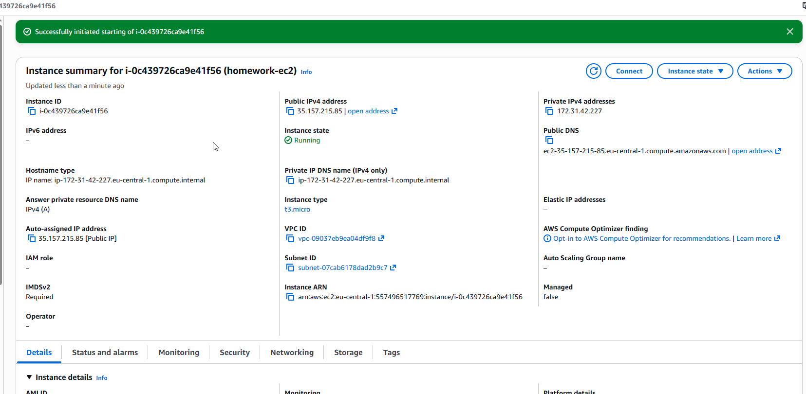

Виконано підключення до EC2 через SSH. Підключення працює, також перевірено версію Ubuntu.

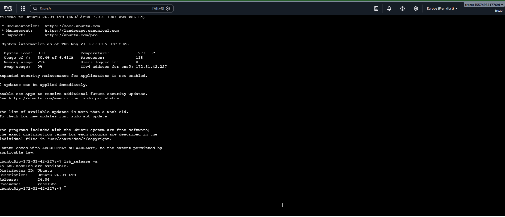

Після перевірки EC2 instance було видалено.

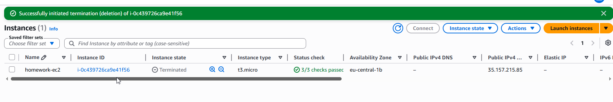

## Завдання 2. S3 та IAM

Створено S3 bucket і завантажено тестовий файл `фільми.txt`.

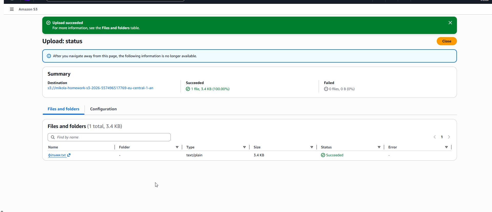

Файл зі створеного S3 bucket було скачано на локальний комп'ютер.

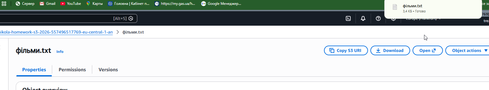

Створено власну IAM policy `s3-homework-policy`, яка надає доступ до S3.

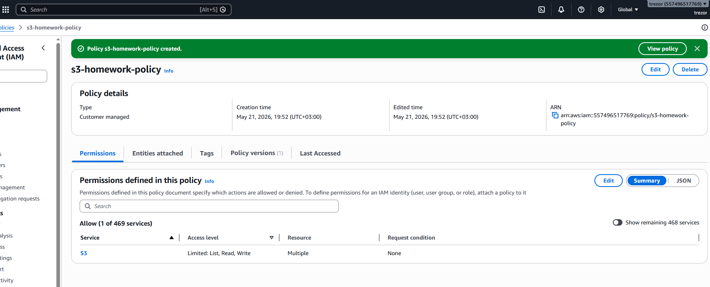

Створено тестового IAM user `s3-test-user`.

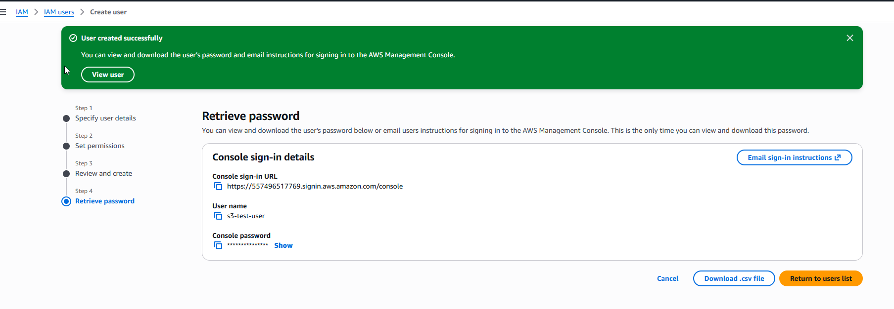

Виконано вхід в AWS Console під тестовим користувачем `s3-test-user`.

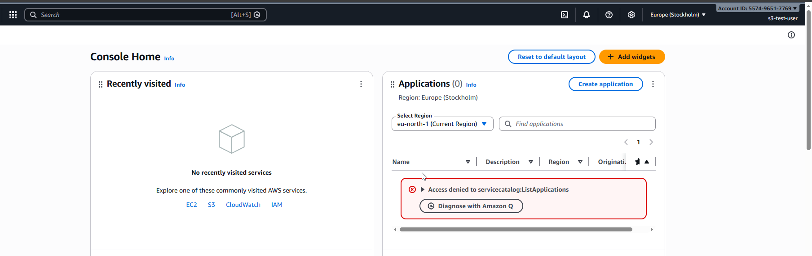

Під тестовим користувачем перевірено доступ до дозволеного S3 bucket.

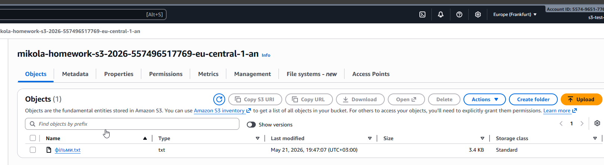

Також перевірено, що тестовий користувач не має доступу до іншого S3 bucket.

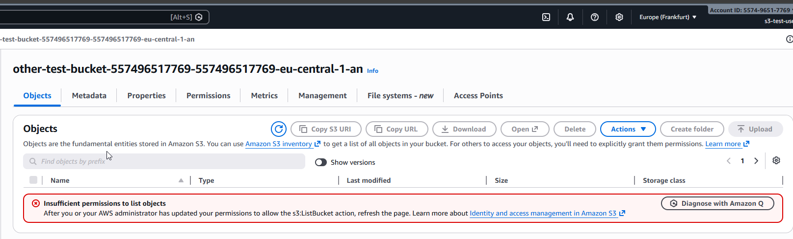

## Видалення створених ресурсів

Після виконання завдання створені ресурси були видалені.

S3 buckets видалено.

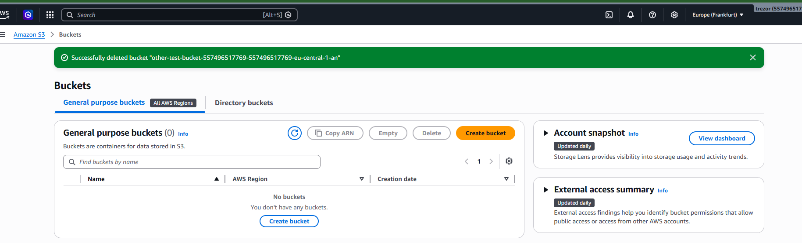

Тестового IAM user видалено.

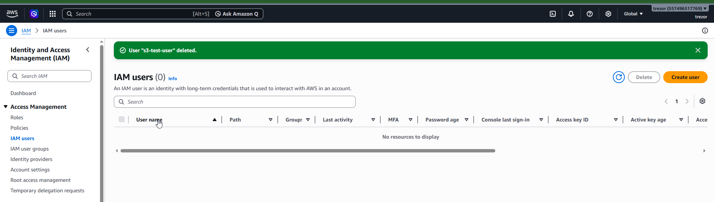

IAM policy видалено.

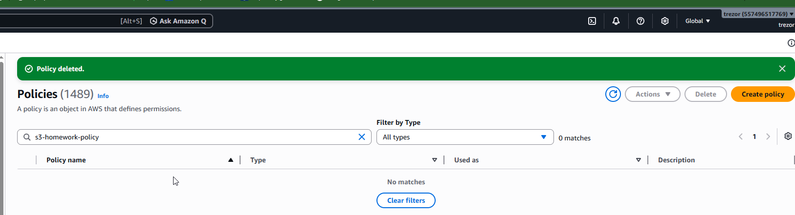
