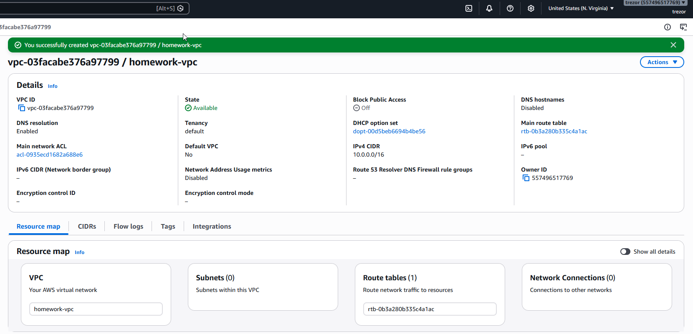
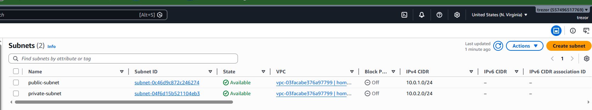
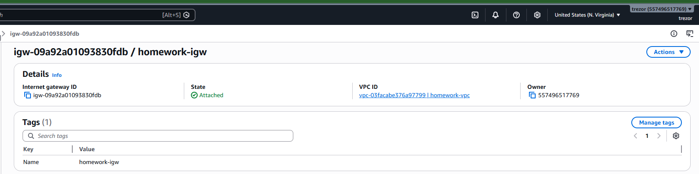
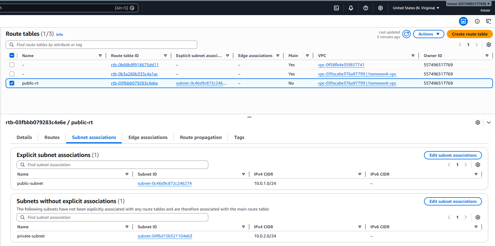
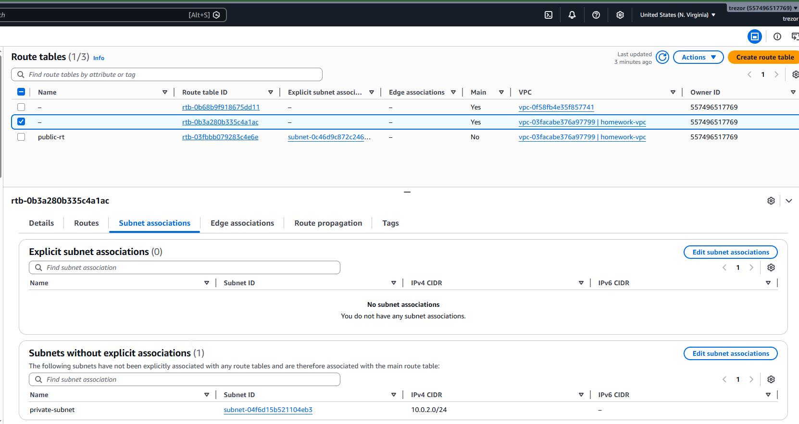
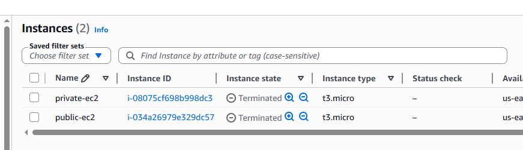
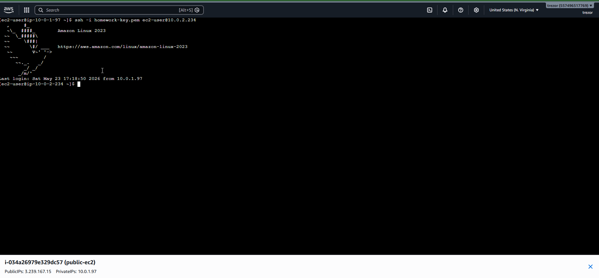
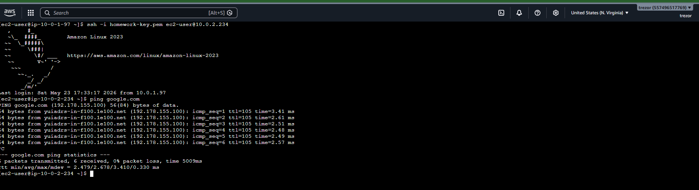

# Домашнє завдання 17

## Створення VPC

Створено VPC `homework-vpc` з CIDR-блоком `10.0.0.0/16`.

## Створення підмереж

Створено дві підмережі:

- `public-subnet` - `10.0.1.0/24`
- `private-subnet` - `10.0.2.0/24`

## Налаштування доступу до інтернету

Для VPC створено та підключено Internet Gateway `homework-igw`.

Для публічної підмережі створено route table `public-rt`, яка асоційована з `public-subnet`.

Приватна підмережа `private-subnet` залишається без explicit association з публічною route table та використовує main route table.

## EC2-інстанси

Створено EC2-інстанс у публічній підмережі:

- `public-ec2`
- Public IP: `3.239.167.15`
- Private IP: `10.0.1.97`

Також створено EC2-інстанс у приватній підмережі:

- Private IP: `10.0.2.234`

На скріні нижче показано обидва створені EC2-інстанси: `public-ec2` та `private-ec2`.
Скрін був доданий пізніше під час оформлення звіту, тому інстанси вже були видалені та відображаються у стані `Terminated`.

## Перевірка SSH-доступу

Підключення до EC2 у публічній підмережі виконано через SSH.

З public EC2 виконано SSH-підключення до EC2 у приватній підмережі за приватною IP-адресою `10.0.2.234`.

## Перевірка доступу до інтернету з private EC2

З EC2 у приватній підмережі виконано `ping google.com`. Відповіді отримано без втрат пакетів, отже інстанс має доступ до інтернету.

