# Homework 18: AWS

## Завдання 1: ECR

У цьому завданні було створено приватний ECR-репозиторій `homework-apache`, зібрано Docker image на локальному комп'ютері, виконано авторизацію в ECR, image було запушено в репозиторій, після чого репозиторій видалено.

### 1. Створений ECR

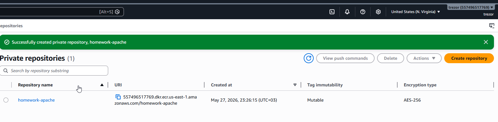

### 2. Dockerfile

Dockerfile створює образ на базі `httpd:2.4`, додає просту сторінку `index.html` і відкриває порт `80`.

```dockerfile
FROM httpd:2.4

RUN echo "Hello from AWS ECR homework!" > /usr/local/apache2/htdocs/index.html

EXPOSE 80
```

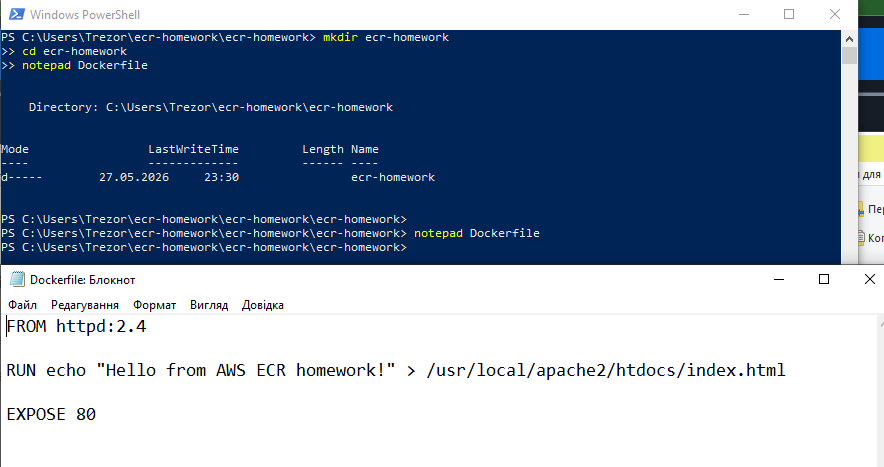

### 3. Опис команд для роботи з ECR

В AWS ECR доступні push commands для авторизації, тегування та завантаження image у репозиторій.


### 4. Локальний білд image з Dockerfile

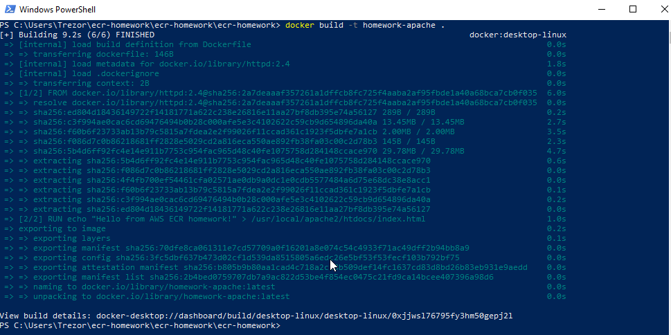

### 5. Логін, тегування та перевірка image

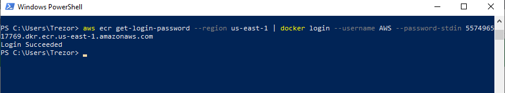

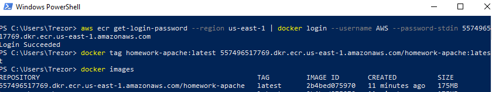

### 6. Push image у створений ECR

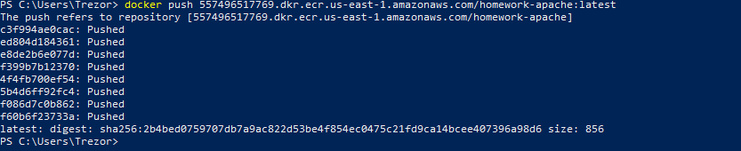

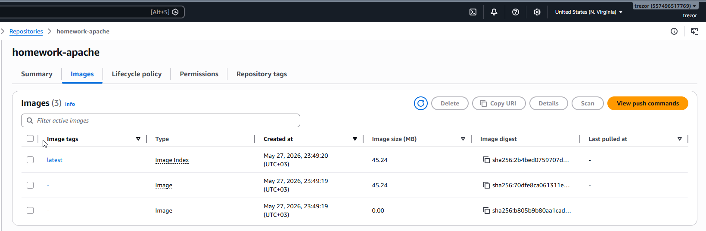

### 7. Видалення ECR-репозиторію

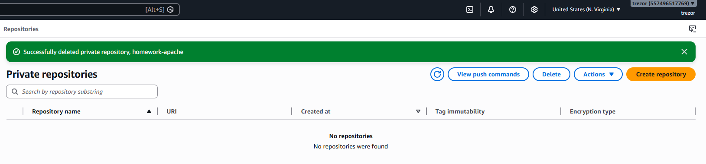

## Завдання 2: RDB

У цьому завданні було створено RDS MySQL database `homework-mysql`, перевірено підключення з локального комп'ютера через MySQL Workbench та після перевірки запущено видалення бази.

### 1. Створена AWS MySQL database

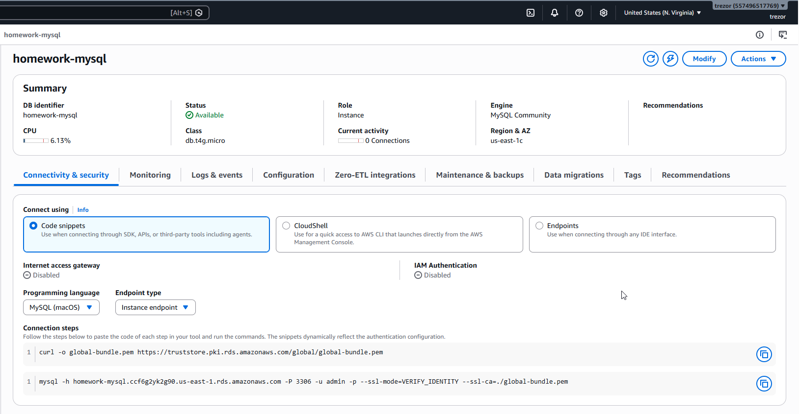

### 2. Підключення до AWS MySQL з власного ПК

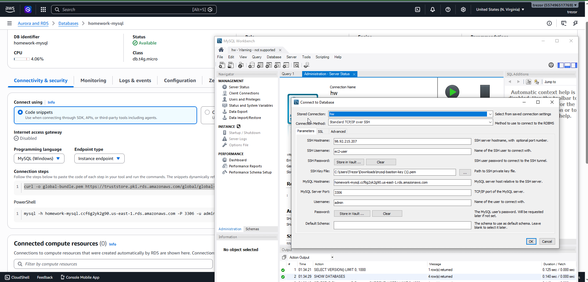

### 3. Видалення AWS MySQL database

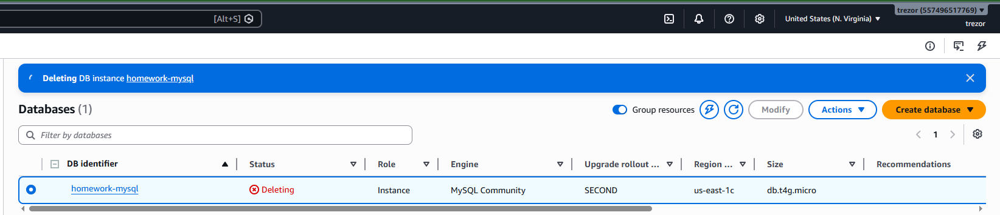

## Завдання 3: Lambda

У цьому завданні було створено Lambda-функцію `stop-ec2-by-tag`, яка знаходить EC2-інстанси у стані `running` з тегом `AutoStop=true` та зупиняє їх. Для перевірки роботи замість очікування 12:00 було використано тестовий розклад `rate(5 minutes)`.

### 1. EventBridge з відповідним тригером

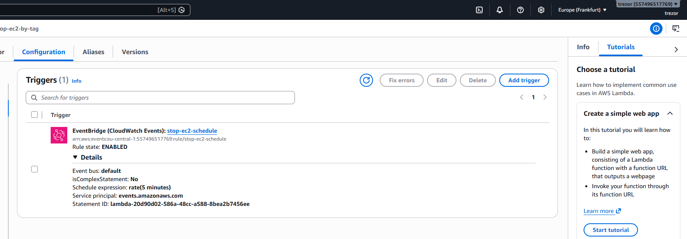

### 2. Створена IAM-роль

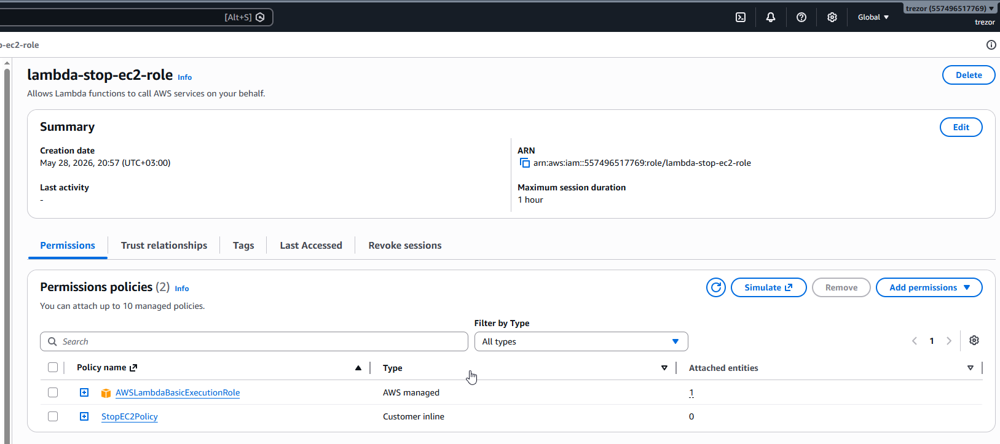

### 3. Зміст IAM-ролі

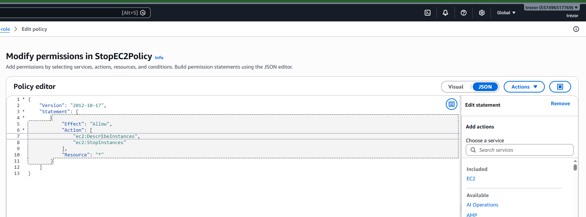

### 4. EC2 з відповідним тегом

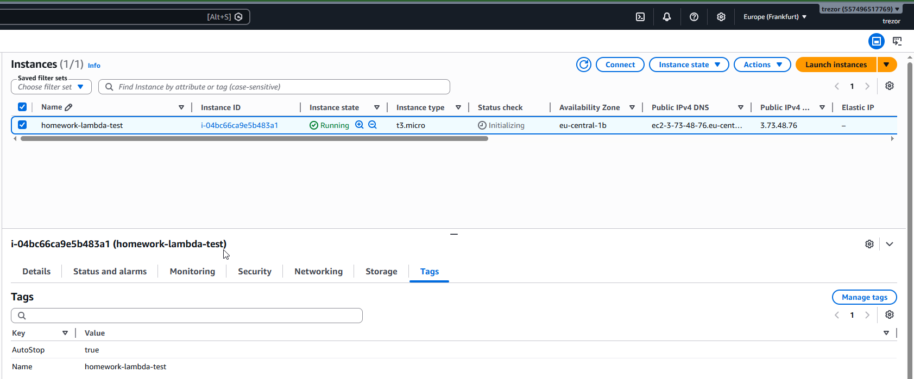

### 5. Lambda Function на Python

```python
import boto3


ec2 = boto3.client("ec2")

TAG_KEY = "AutoStop"
TAG_VALUE = "true"


def lambda_handler(event, context):
    response = ec2.describe_instances(
        Filters=[
            {"Name": f"tag:{TAG_KEY}", "Values": [TAG_VALUE]},
            {"Name": "instance-state-name", "Values": ["running"]},
        ]
    )

    instance_ids = []

    for reservation in response["Reservations"]:
        for instance in reservation["Instances"]:
            instance_ids.append(instance["InstanceId"])

    if not instance_ids:
        print("No running EC2 instances found with tag AutoStop=true")
        return {
            "statusCode": 200,
            "message": "No running instances found",
        }

    ec2.stop_instances(InstanceIds=instance_ids)
    print(f"Stopped instances: {instance_ids}")

    return {
        "statusCode": 200,
        "stopped_instances": instance_ids,
    }
```

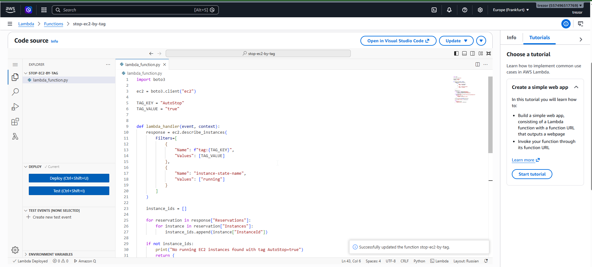

### 6. Перевірка роботи Lambda

У логах CloudWatch видно, що Lambda знайшла інстанс з тегом `AutoStop=true` та виконала його зупинку. Наступні запуски вже показують повідомлення, що запущених EC2 з таким тегом немає.

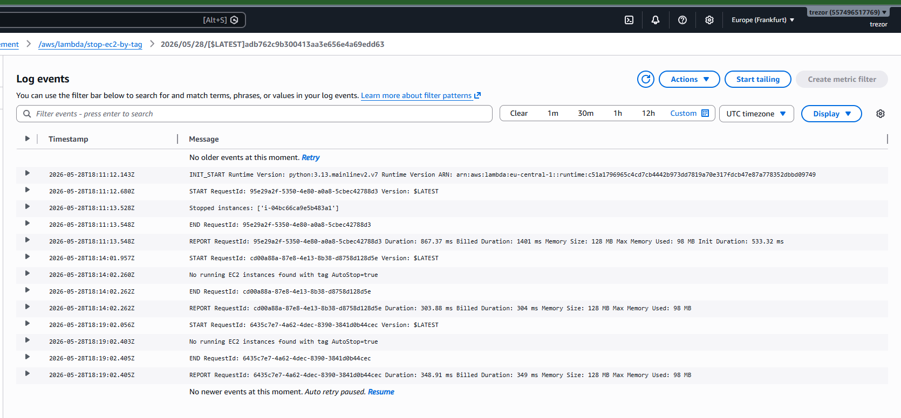

### 7. Видалення Lambda Function й IAM-ролі

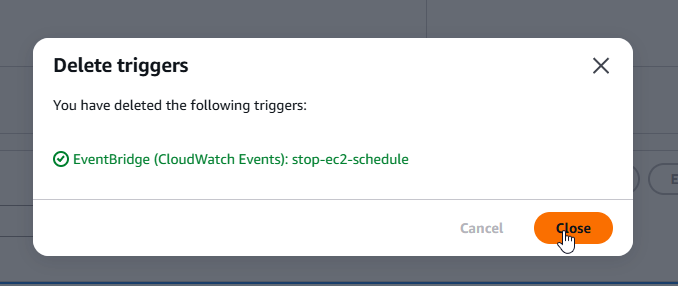

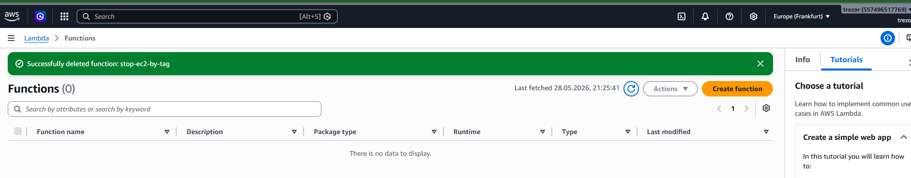

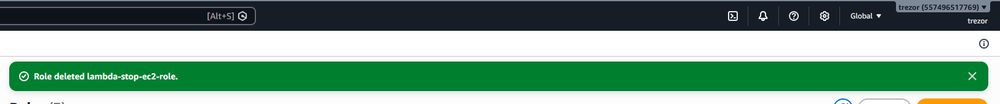
