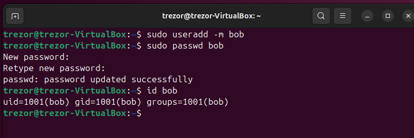
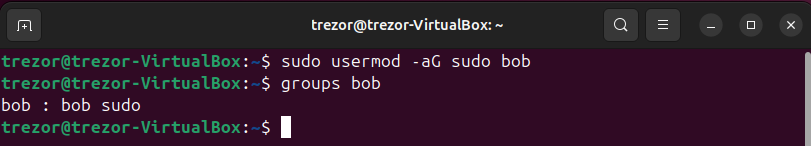
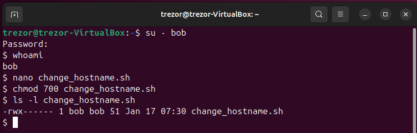
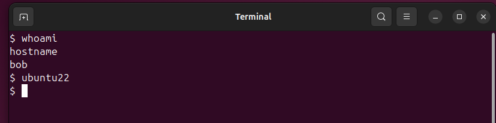
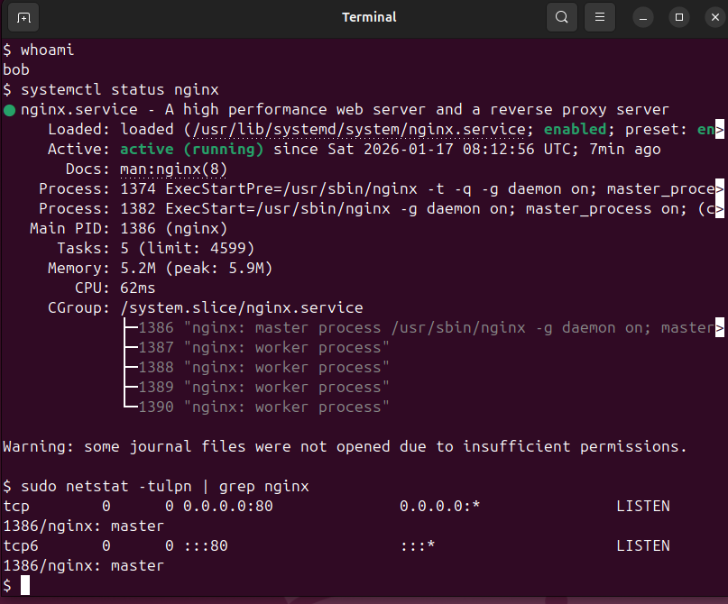

# HW 4 — System Management

## Завдання
- Створити користувача `bob`
- Додати користувача до групи `sudo`
- Створити сценарій у `/home/bob/`, який змінює hostname на `ubuntu22`
- Запустити сценарій від користувача `bob`
- Встановити та перевірити роботу `nginx`
- Перевірити відкриті порти за допомогою `netstat`

Середовище виконання:
- ОС: Ubuntu 24.04 LTS
- Віртуалізація: VirtualBox

---

## 1. Створення користувача `bob`

Було створено користувача `bob` з домашнім каталогом та задано пароль.

---

## 2. Додавання користувача `bob` до групи sudo

Користувача `bob` додано до групи `sudo`, що дозволяє виконувати команди з правами адміністратора.

---

## 3. Створення сценарію зміни hostname

У каталозі `/home/bob/` створено сценарій `change_hostname.sh`, який змінює імʼя хоста на `ubuntu22`.

Для сценарію встановлено права доступу `700`, що дозволяє виконання **виключно користувачу `bob`**.

---

## 4. Зміна hostname при запуску від користувача `bob`

Після виконання сценарію та перезавантаження системи, під час входу під користувачем `bob` hostname змінено на `ubuntu22`.

---

## 5. Перевірка роботи nginx та відкритих портів

Встановлено вебсервер `nginx`.  
Перевірено, що сервіс працює (`active (running)`), а також що порт `80` відкритий та прослуховується процесом `nginx`.

---

## Висновок

Усі пункти завдання виконано відповідно до вимог.  
Система налаштована коректно, користувач `bob` має необхідні права, hostname змінено, вебсервер `nginx` працює.
