## Exercise 1: Hello World

Було створено Bash-скрипт `hello_world.sh`, який виводить повідомлення `Hello, World!` у стандартний вивід.

**Код скрипта:**
```bash
#!/bin/bash
echo "Hello, World!"
```
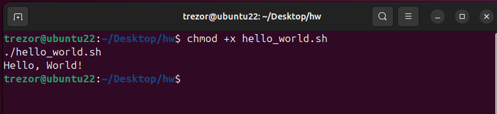


## Exercise 2: User Input

**Назва скрипта:** `user_input.sh`

**Код скрипта:**
```bash
#!/bin/bash

read -p "Enter your name: " name
echo "Hello, $name!"
```
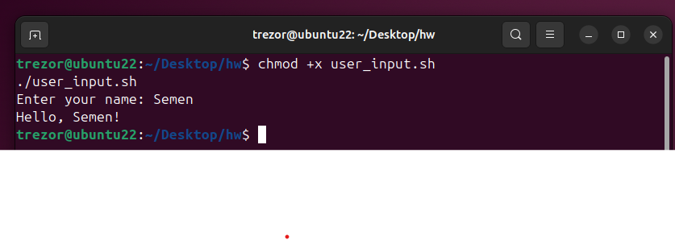


## Exercise 3: Conditional Statements

**Назва скрипта:** `check_file.sh`

**Код скрипта:**
```bash
#!/bin/bash

read -p "Enter filename to check: " filename

if [ -f "$filename" ]; then
    echo "File '$filename' exists."
else
    echo "File '$filename' does not exist."
fi
```
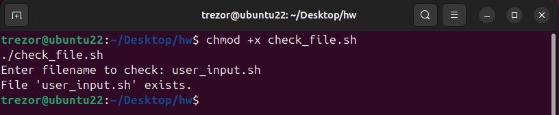


## Exercise 4: Looping

**Назва скрипта:** `loop_numbers.sh`

**Код скрипта:**
```bash
#!/bin/bash

for i in {1..10}
do
    echo "$i"
done
```
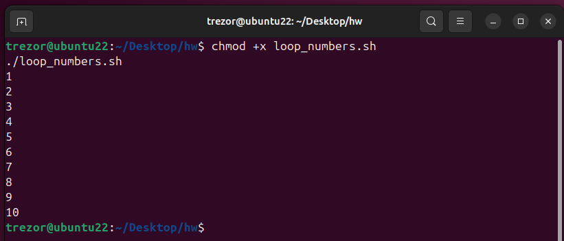


## Exercise 5: File Operations

**Назва скрипта:** `copy_file.sh`

**Код скрипта:**
```bash
#!/bin/bash

if [ "$#" -ne 2 ]; then
    echo "Usage: $0 <source_file> <destination_file>"
    exit 1
fi

source_file="$1"
destination_file="$2"

if [ ! -f "$source_file" ]; then
    echo "Source file does not exist."
    exit 1
fi

cp "$source_file" "$destination_file"
echo "File copied successfully."
```
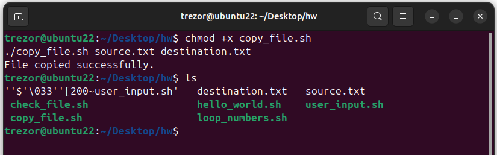


## Exercise 6: String Manipulation

**Назва скрипта:** `reverse_sentence.sh`

**Код скрипта:**
```bash
#!/bin/bash

read -p "Enter a sentence: " sentence
echo "$sentence" | awk '{ for (i=NF; i>0; i--) printf "%s%s", $i, (i==1?ORS:OFS) }'
```
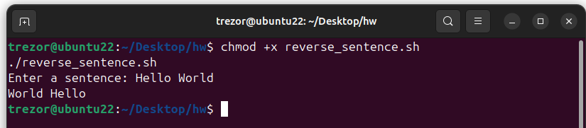


## Exercise 7: Command Line Arguments

**Назва скрипта:** `count_lines.sh`

**Код скрипта:**
```bash
#!/bin/bash
wc -l "$1"
```
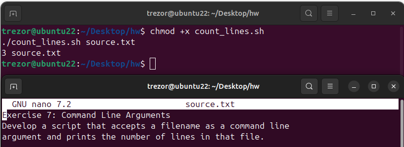


## Exercise 8: Arrays

**Назва скрипта:** `fruits_array.sh`

**Код скрипта:**
```bash
#!/bin/bash

fruits=("Apple" "Banana" "Orange" "Grapes")

for fruit in "${fruits[@]}"
do
    echo "$fruit"
done
```
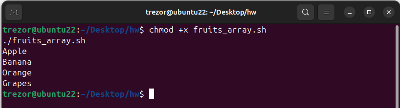


## Exercise 9: Error Handling

**Назва скрипта:** `read_file.sh`

**Код скрипта:**
```bash
#!/bin/bash

if [ -f "$1" ]; then
    cat "$1"
else
    echo "Error: file does not exist."
fi
```
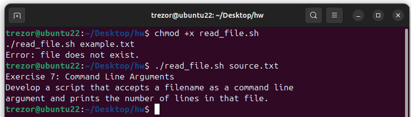


## 10. Watch script

**Назва скрипта:** `watch_dir.sh`

**Код скрипта:**
```bash
#!/bin/bash

WATCH_DIR="$HOME/watch"

mkdir -p "$WATCH_DIR"

while true; do
  for file in "$WATCH_DIR"/*; do
    [ -f "$file" ] || continue

    cat "$file"
    mv "$file" "$file.back"
  done

  sleep 1
done
```
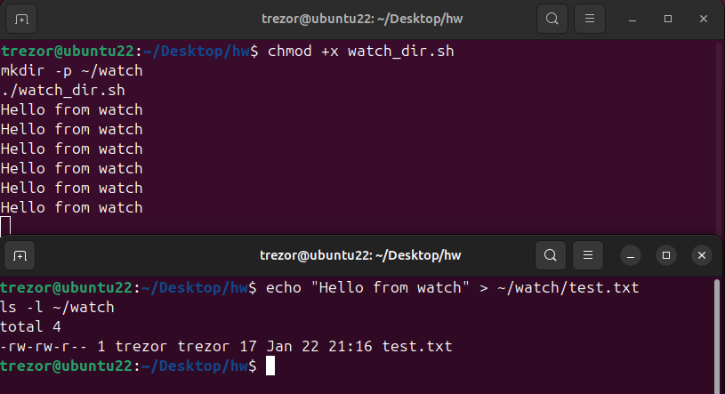


## 11. Systemd service

Було створено systemd-сервіс, який запускає bash-скрипт для моніторингу директорії `~/watch`.

**Код service unit:**
```ini
[Unit]
Description=Watch directory and rename new files
After=network.target

[Service]
ExecStart=/bin/bash /home/trezor/Desktop/hw/watch_dir.sh
Restart=always
RestartSec=2

[Install]
WantedBy=multi-user.target
```
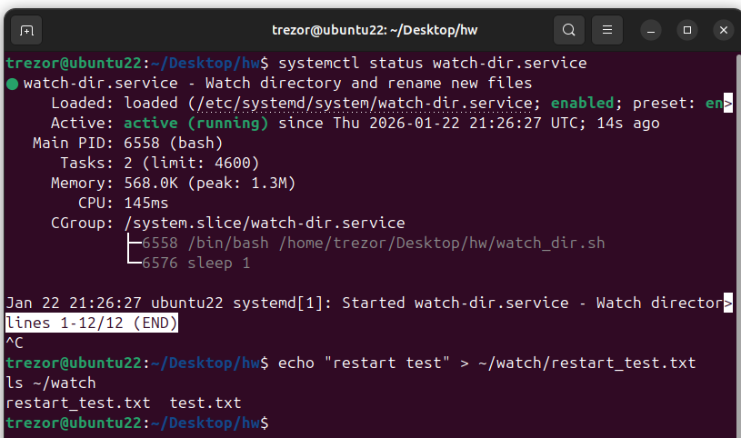