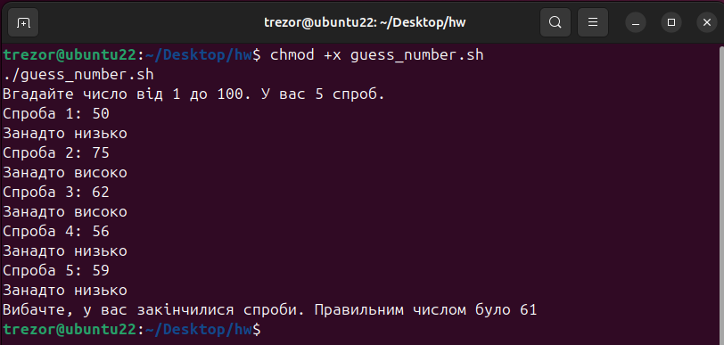
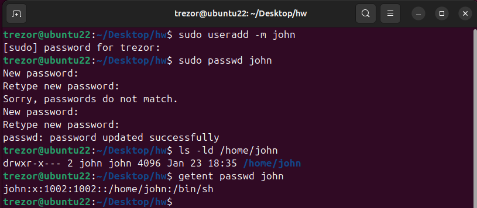
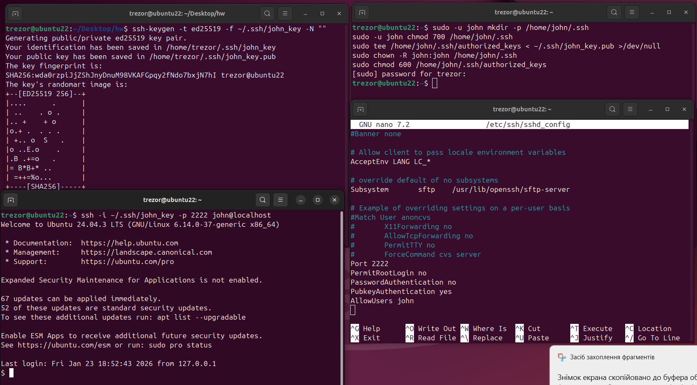
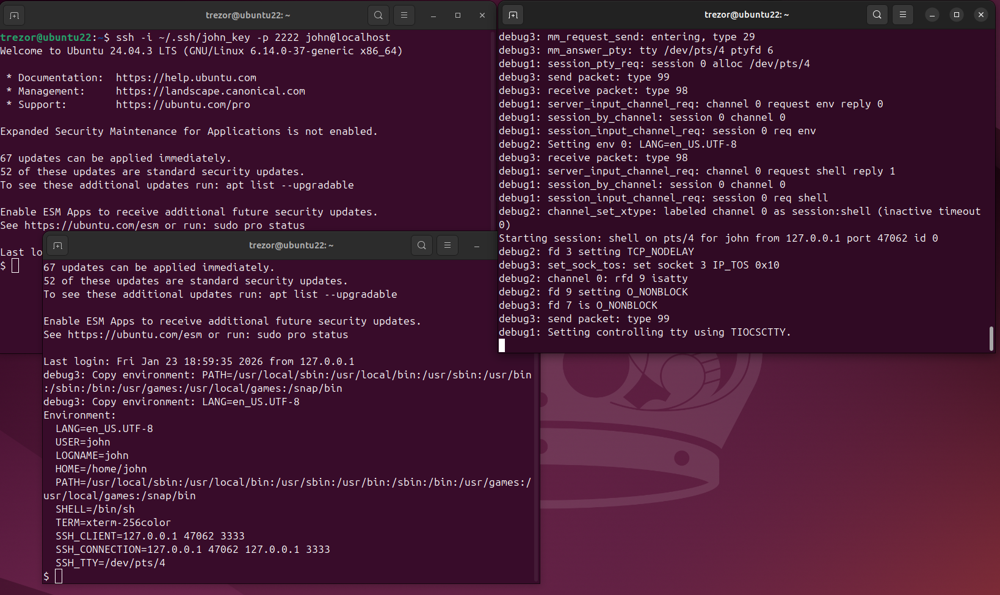

## Exercise 1: Guess the Number

**Назва скрипта:** `guess_number.sh`

**Код скрипта:**
```bash
#!/bin/bash

number=$((RANDOM % 100 + 1))
max_attempts=5
attempt=1

echo "Вгадайте число від 1 до 100. У вас $max_attempts спроб."

while [ $attempt -le $max_attempts ]; do
    read -p "Спроба $attempt: " guess

    if [ "$guess" -eq "$number" ]; then
        echo "Вітаємо! Ви вгадали правильне число"
        exit 0
    elif [ "$guess" -lt "$number" ]; then
        echo "Занадто низько"
    else
        echo "Занадто високо"
    fi

    attempt=$((attempt + 1))
done

echo "Вибачте, у вас закінчилися спроби. Правильним числом було $number"
```



## Exercise 2: Create User

**Опис:**  
Було створено користувача `john` з домашньою директорією за типовим шляхом `/home/john`.

**Команди виконання:**
```bash
sudo useradd -m john
sudo passwd john
```



## Exercise 3: SSH Server Configuration (Port 2222)

**Опис:**  
Було встановлено та налаштовано SSH-сервер, який прослуховує порт `2222`.  
Вхід для користувача `root` заборонений, авторизація за паролем вимкнена.  
Підключення дозволене лише для користувача `john` і тільки за допомогою SSH-ключа.




## Exercise 4: SSH Debug Mode (Port 3333)

**Опис:**  
Було паралельно запущено SSH-сервер у режимі налагодження, який прослуховує порт `3333`.  
Дозволено підключення за **паролем і SSH-ключем**.  
Обмеження на користувачів відсутні, **окрім заборони доступу для `root`**.  
SSH-сервер працює паралельно з основним сервером на порту `2222` і не використовує `systemd`.

**Запуск SSH у режимі налагодження:**
```bash
sudo /usr/sbin/sshd -D -d -p 3333 \
  -o PermitRootLogin=no \
  -o PasswordAuthentication=yes \
  -o PubkeyAuthentication=yes
```
