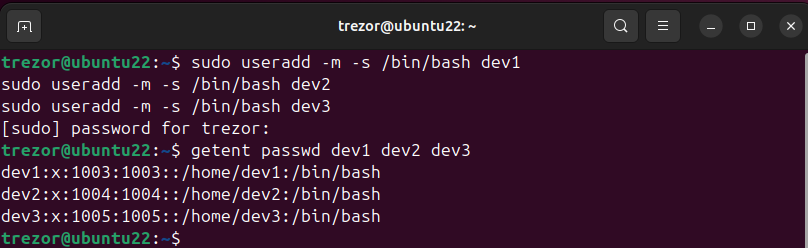
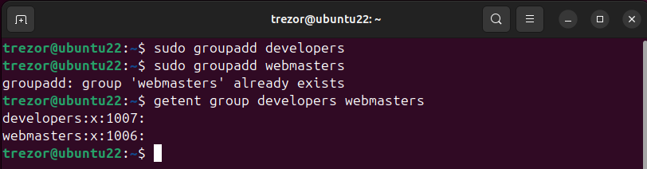
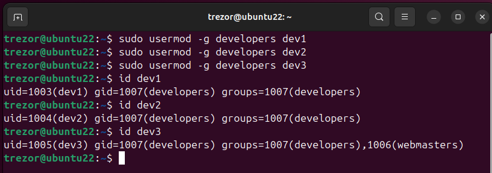
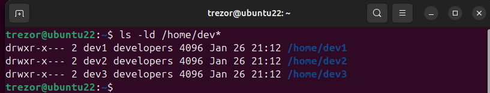
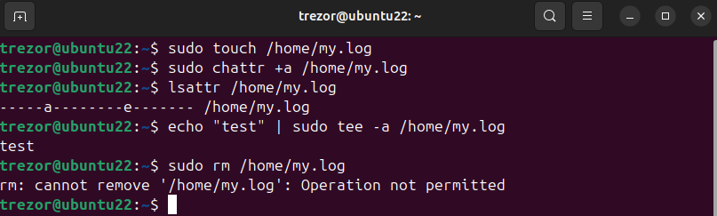

## Task 1.1: User Accounts

Було створено облікові записи користувачів для розробників: `dev1`, `dev2`, `dev3`.

**Команди створення користувачів:**
```bash
sudo useradd -m -s /bin/bash dev1
sudo useradd -m -s /bin/bash dev2
sudo useradd -m -s /bin/bash dev3
```



## Task 1.2: Groups Creation

Було створено дві групи: `developers` та `webmasters`.

**Команди створення груп:**
```bash
sudo groupadd developers
sudo groupadd webmasters
```


## Task 1.3: Assign Users to Groups

Користувачі `dev1` і `dev2` додані до групи `developers`,  
користувач `dev3` доданий до групи `webmasters`.

**Команди призначення користувачів до груп:**
```bash
sudo usermod -aG developers dev1
sudo usermod -aG developers dev2
sudo usermod -aG webmasters dev3
```


## Task 1.4: Default Group

Групу `developers` встановлено як групу за замовчуванням для користувачів `dev1`, `dev2`, `dev3`.

**Команди встановлення primary group:**
```bash
sudo usermod -g developers dev1
sudo usermod -g developers dev2
sudo usermod -g developers dev3
```


## Task 1.5: Home Directories

Домашні каталоги для користувачів `dev1`, `dev2`, `dev3` створені автоматично під час створення облікових записів  
з використанням ключа `-m` команди `useradd`.

**Перевірка наявності домашніх каталогів:**
```bash
ls -ld /home/dev*
```


## Task 1.6: Clone User Account

Створено користувача `backupdev` та виконано клонування домашнього каталогу користувача `dev1`.

```bash
sudo useradd -m -s /bin/bash backupdev
sudo cp -a /home/dev1 /home/backupdev
sudo chown -R backupdev:backupdev /home/backupdev
```


## Task 1.7: Shared Project Directory

Створено каталог `web_project` у `/home` та надано групі `developers` права на читання і запис.

```bash
sudo mkdir /home/web_project
sudo chown :developers /home/web_project
sudo chmod 2775 /home/web_project
ls -ld /home/web_project
```


## Task 1.8: Append-only Log File

Створено файл журналу `my.log` у каталозі `/home` та встановлено атрибут `append-only`, який забороняє зміну або видалення файлу, дозволяючи лише додавання нового вмісту в кінець файлу.

```bash
sudo touch /home/my.log
sudo chattr +a /home/my.log
lsattr /home/my.log
echo "test" | sudo tee -a /home/my.log
sudo rm /home/my.log
```
