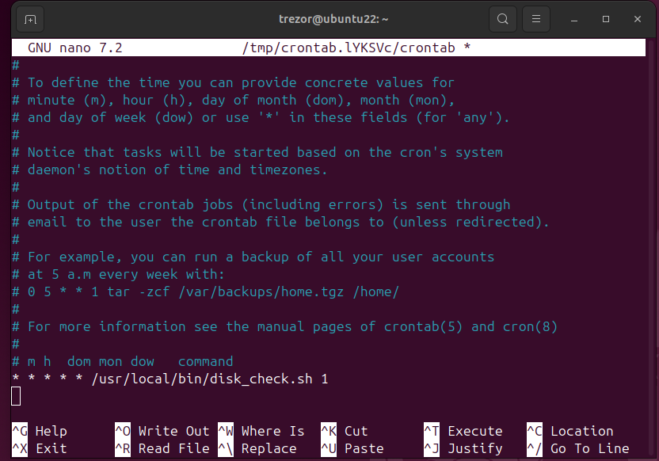
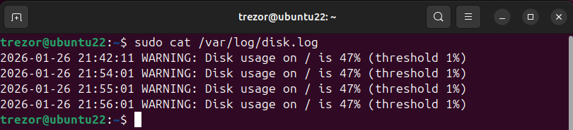

## Task 2: Disk Usage Monitoring (cron)

Створено bash-скрипт для моніторингу використання файлової системи `/`. Скрипт запускається за розкладом через `cron`. Якщо використання диска перевищує X% (значення X передається з crontab), скрипт автоматично записує попереджувальне повідомлення у файл журналу `/var/log/disk.log`.

```bash
#!/bin/bash

THRESHOLD="${1:-80}"
LOG_FILE="/var/log/disk.log"

USAGE="$(df -P / | awk 'NR==2 {gsub("%","",$5); print $5}')"
TS="$(date '+%Y-%m-%d %H:%M:%S')"

if [ "$USAGE" -ge "$THRESHOLD" ]; then
  echo "$TS WARNING: Disk usage on / is ${USAGE}% (threshold ${THRESHOLD}%)" >> "$LOG_FILE"
fi
```



