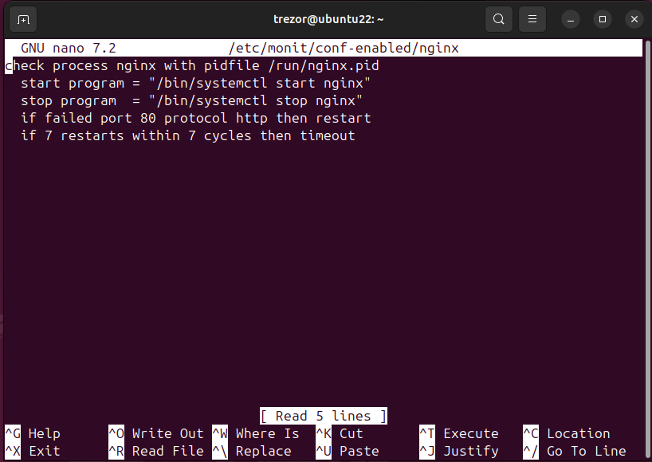
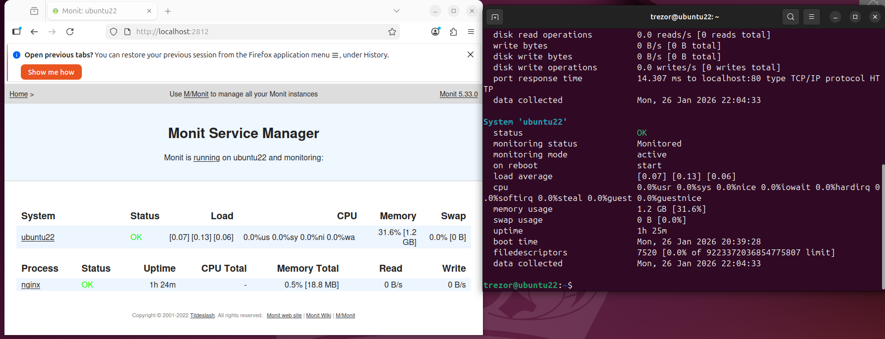

## Task 3: Monit Configuration for Nginx

Налаштовано Monit для моніторингу служби `nginx`. Monit перевіряє доступність сервісу на `localhost:80`. Якщо служба залишається недоступною після 7 перевірок/перезапусків, Monit припиняє спроби перезапуску.

**Встановлення необхідних пакетів:**
```bash
sudo apt update
sudo apt install -y nginx monit
sudo systemctl enable --now nginx
sudo systemctl enable --now monit
```

**Увімкнення Web UI Monit (/etc/monit/monitrc):**
```bash
set httpd port 2812 and
    use address localhost
    allow localhost
```

**Конфіг Monit для nginx (/etc/monit/conf-enabled/nginx):**



