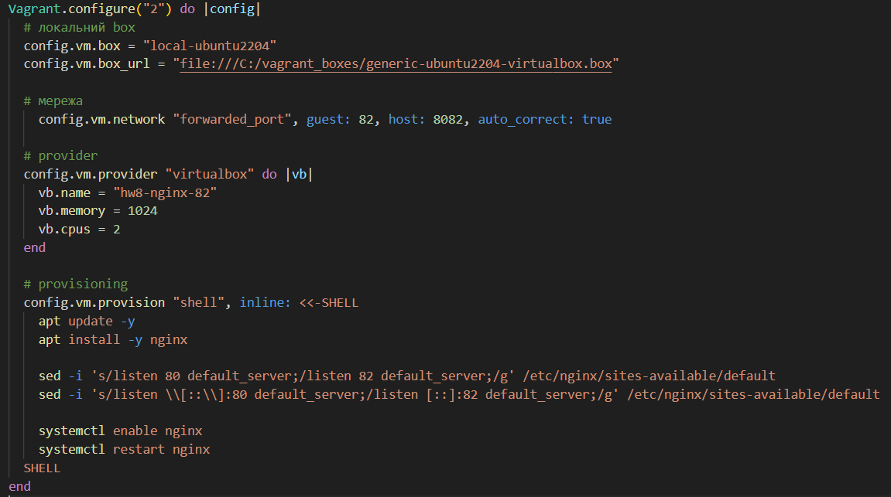
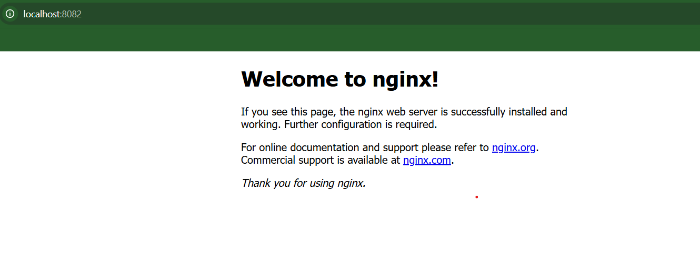

## HW8 — Vagrant + VirtualBox + Ubuntu + nginx (port 82)

### Умова
За допомогою Vagrant створити віртуальну машину Ubuntu.
Встановити та налаштувати nginx так, щоб він слухав **82 порт**.
Показати сторінку nginx, яка відкривається на цьому порту.

---

### 1. Vagrantfile

Конфігурація Vagrant, яка створює VM, встановлює nginx
та змінює стандартний порт з 80 на **82**.



---

### 2. Скрін сторінки, яку відображає nginx на 82-му порті

Сторінка відкривається з хоста через port forwarding:
(82 порт усередині VM)
***http://localhost:8082***



---

### 3. Перевірка nginx всередині VM

```bash
sudo ss -lntp | grep nginx
```

### 4. Запуск
```bash
vagrant up
vagrant reload --provision
```