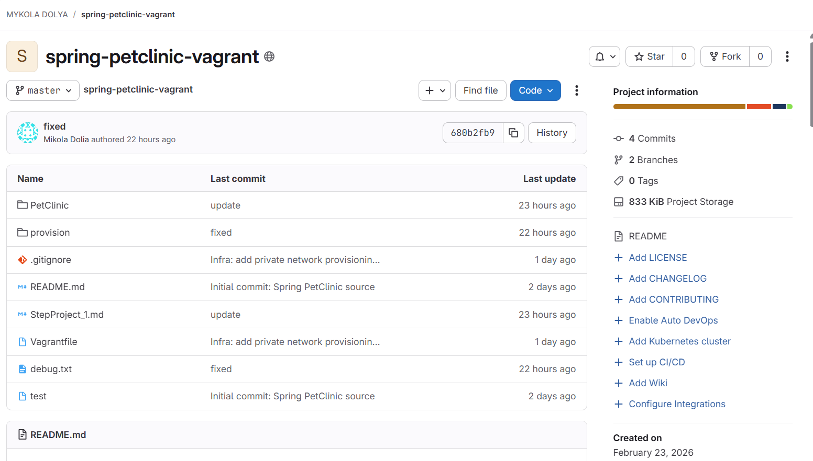
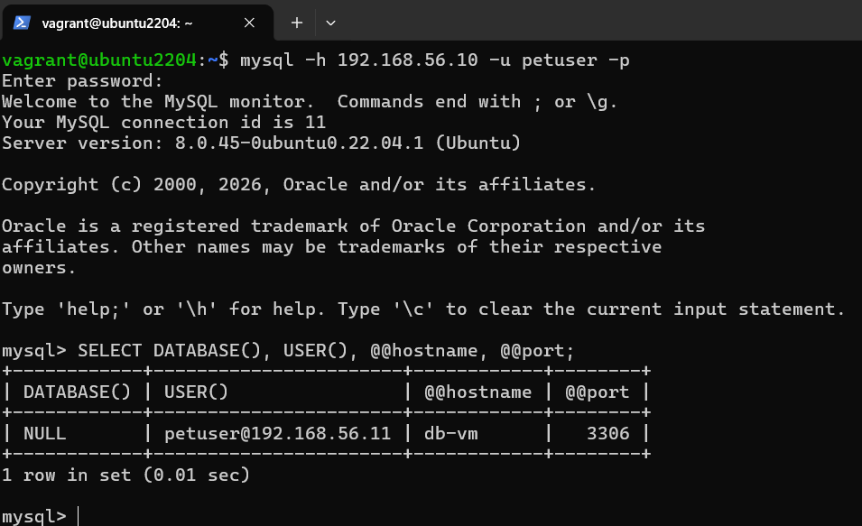
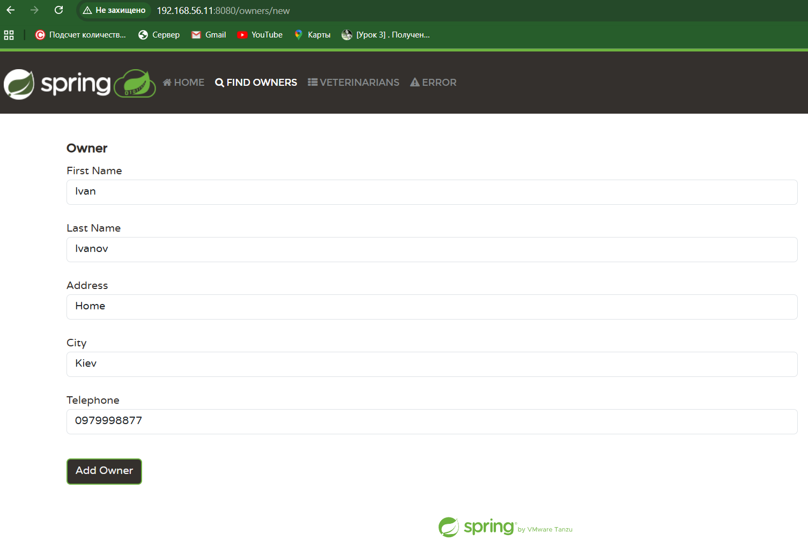
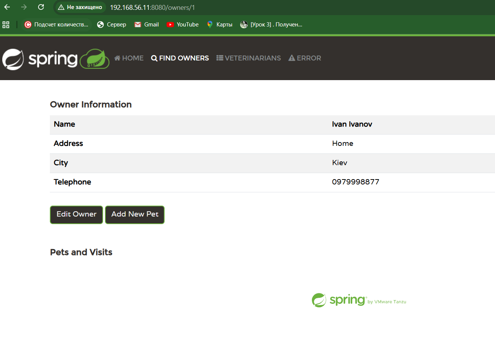

# Spring PetClinic + Vagrant

## 1) Код змісту Vagrantfile

```ruby
Vagrant.configure("2") do |config|
  config.vm.box = "generic/ubuntu2204"

  # ===== ENV from host (PowerShell) =====
  db_name  = ENV["DB_NAME"]
  db_user  = ENV["DB_USER"]
  db_pass  = ENV["DB_PASS"]
  app_user = ENV["APP_USER"]

  missing = []
  missing << "DB_NAME"  if db_name.nil?  || db_name.strip.empty?
  missing << "DB_USER"  if db_user.nil?  || db_user.strip.empty?
  missing << "DB_PASS"  if db_pass.nil?  || db_pass.strip.empty?
  missing << "APP_USER" if app_user.nil? || app_user.strip.empty?

  unless missing.empty?
    raise "Missing required host environment variables: #{missing.join(', ')}. " \
          "Set them before running vagrant up."
  end

  # ===== Network + app params =====
  db_host     = "192.168.56.10"
  app_host    = "192.168.56.11"
  db_port     = "3306"
  project_dir = "/opt/petclinic"
  repo_url    = "https://github.com/spring-projects/spring-petclinic.git"

  # ======================
  # DB_VM
  # ======================
  config.vm.define "DB_VM" do |db|
    db.vm.hostname = "db-vm"
    db.vm.network "private_network", ip: db_host

    db.vm.provision "shell",
      path: "provision/db.sh",
      args: [db_host, db_port, db_name, db_user, db_pass]
  end

  # ======================
  # APP_VM
  # ======================
  config.vm.define "APP_VM" do |app|
    app.vm.hostname = "app-vm"
    app.vm.network "private_network", ip: app_host

    app.vm.provision "shell",
      path: "provision/app.sh",
      args: [db_host, db_port, db_name, db_user, db_pass, app_user, project_dir, repo_url]
  end
end
```

## 2) Скрін git репозиторія з проектом PetClinic
А тут [посилання](https://gitlab.com/mdolya/spring-petclinic-vagrant.git)


## 3) Скрін підключення з однієї VM до MySQL на іншій VM


# 4) Кроки, виконані вручну
- Всі кроки автоматизовані через Vagrant provisioning (provision/db.sh, provision/app.sh).
- Вручну виконувалась лише одноразова правка конфіга повідомлень (щоб не було ??key??)<br>
команда ```vagrant ssh APP_VM -c "echo 'spring.messages.basename=messages/messages' | sudo tee -a /home/appuser/application.properties >/dev/null && sudo systemctl restart petclinic"```
# 5) Скрін роботи аплікації на 8080 з прикладом додавання своїх даних

# 6) Скрін сайту з існуючими й своїми доданими даними
