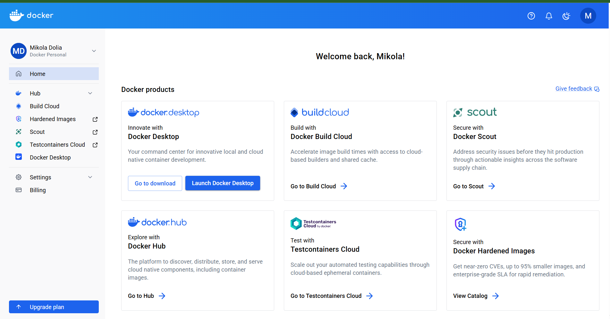
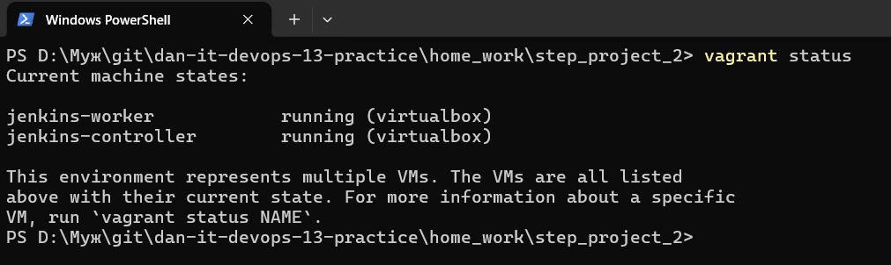
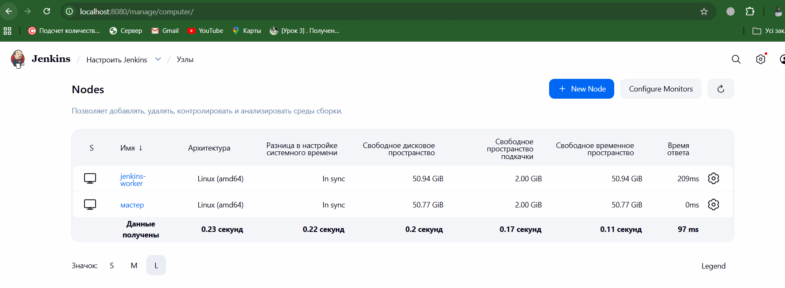
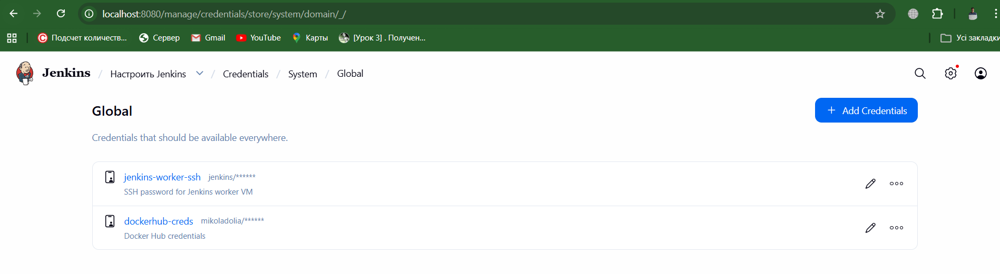
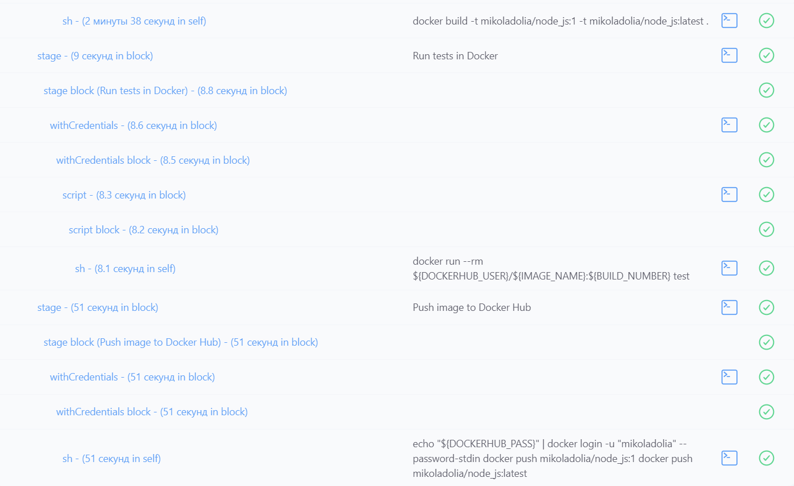
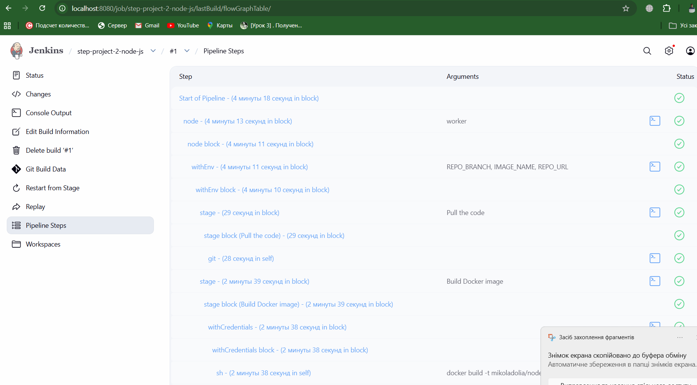
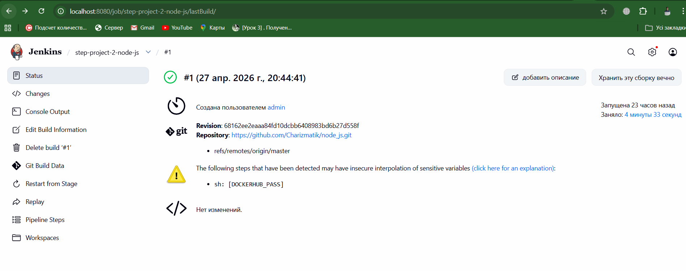

# Step Project 2 - Jenkins pipeline для Node.js app

## 1. GitHub repository з Node.js app

Репозиторій з Node.js застосунком:

[https://github.com/Charizmatik/node_js.git](https://github.com/Charizmatik/node_js.git)

Основна гілка: `master`.

## 2. Docker Hub account

Docker Hub username: `mikoladolia`



## 3. Vagrantfile

Код Vagrantfile: [Vagrantfile](./Vagrantfile)

Vagrant створює дві VM:

- `jenkins-controller` - Jenkins server, порт `8080`;
- `jenkins-worker` - Jenkins worker для виконання pipeline.

Скріншот статусу VM:



## 4. Jenkins worker

Worker node створюється автоматично через `Vagrantfile`.

Скріншот підключеного worker:



## 5. Docker Hub credentials у Jenkins

Credentials ID:

```text
dockerhub-creds
```

Скріншот credentials:



## 6. Pipeline code

Код pipeline: [Jenkinsfile](./Jenkinsfile)

Pipeline job у Jenkins:

```text
step-project-2-node-js
```

Pipeline виконує такі кроки:

1. `Pull the code`
2. `Build Docker image`
3. `Run tests in Docker`
4. `Push image to Docker Hub`

Якщо тести не проходять, pipeline виводить:

```text
Tests failed
```

## 7. Pipeline result

Результат build #1:

```text
Finished: SUCCESS
```

Docker image:

```text
mikoladolia/node_js:1
mikoladolia/node_js:latest
```

Скріншоти роботи pipeline:






